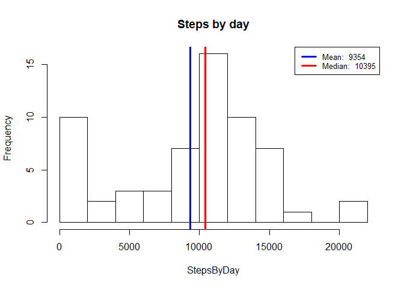
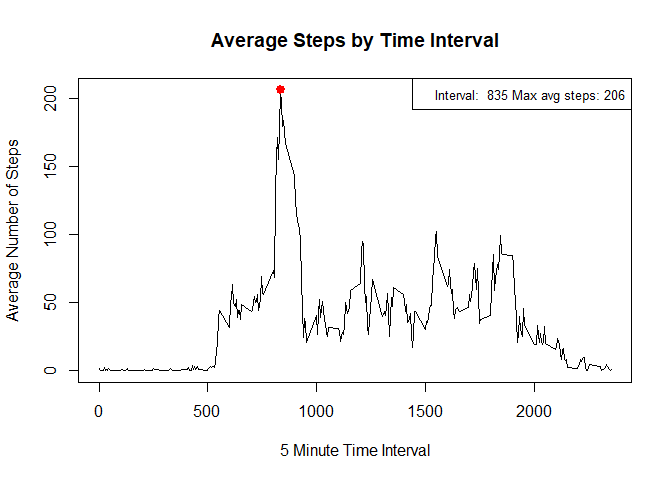
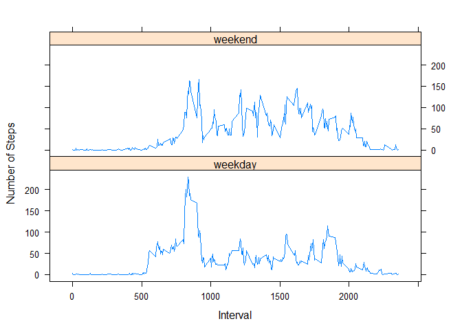

## PROYECT 1


The solution to the exercises proposed in project 1 of the subject of "Reproducible Research" is presented below.

### DATA LOAD

The data is loaded in the variable "MyData", the dataset is available in this link [activity.csv](https://d396qusza40orc.cloudfront.net/repdata%2Fdata%2Factivity.zip)


```r
library(dplyr)
```

```
## 
## Attaching package: 'dplyr'
```

```
## The following objects are masked from 'package:stats':
## 
##     filter, lag
```

```
## The following objects are masked from 'package:base':
## 
##     intersect, setdiff, setequal, union
```

```r
MyData <- read.csv("activity.csv")
str(MyData)
```

```
## 'data.frame':	17568 obs. of  3 variables:
##  $ steps   : int  NA NA NA NA NA NA NA NA NA NA ...
##  $ date    : Factor w/ 61 levels "2012-10-01","2012-10-02",..: 1 1 1 1 1 1 1 1 1 1 ...
##  $ interval: int  0 5 10 15 20 25 30 35 40 45 ...
```

###What is mean total number of steps taken per day?

For this part of the assignment, you can ignore the missing values in the dataset.

Calculate the total number of steps taken per day
If you do not understand the difference between a histogram and a barplot, research the difference between them. Make a histogram of the total number of steps taken each day
Calculate and report the mean and median of the total number of steps taken per day

R/ In this code i group by day and sum the steps whitout na values, calculate mean and median and finaly make de histogram


```r
StepsByDay <-  group_by(MyData, date) %>% 
    summarise(t_steps=sum(steps, na.rm = TRUE)) %>% 
    select(t_steps) %>% unlist()

##calculate the mean and median 
media <- round(mean(StepsByDay))
mediana <- median(StepsByDay)

hist(StepsByDay , main="Steps by day", breaks = 15)
    abline(v=round(media), lwd = 3, col = 'blue')
    abline(v=mediana, lwd = 3, col = 'red')
      legend('topright', lty = 1, lwd = 3, col = c("blue", "red"),
            cex = .8, 
            ##show mean and median 
            legend = c(paste('Mean: ', round(media)),
                       paste('Median: ', mediana))
     )
```

<!-- -->

###What is the average daily activity pattern?

Make a time series plot (i.e. \color{red}{\verb|type = "l"|}type="l") of the 5-minute interval (x-axis) and the average number of steps taken, averaged across all days (y-axis)
Which 5-minute interval, on average across all the days in the dataset, contains the maximum number of steps?

R/ In this part, group by intervale and calculate mean of steps, and bulding the point and legend whit de max of step 

```r
##Generate dataframe with mean steps for each interval
StepsByInterval <-  group_by(MyData, interval) %>% 
    summarise(m_steps=mean(steps, na.rm = TRUE)) 

plot(StepsByInterval, type = 'l',
      main = 'Average Steps by Time Interval',
      xlab = '5 Minute Time Interval',
      ylab = 'Average Number of Steps')

##Generate point whit max steps for interval
points(StepsByInterval[which.max(StepsByInterval$m_steps),]
       , col = 'red', lwd = 3, pch = 19)

legend('topright', cex = .8,
       legend = c(paste('Interval: ',               
                    ##interval whit max step
                    StepsByInterval[which.max(StepsByInterval$m_steps),][1,1],
                  paste('Max avg steps:',
                        ##value of max average of steps
                        round (StepsByInterval[which.max(StepsByInterval$m_steps),][1,2])))
      ))
```

<!-- -->

```r
## dataframe whit interval with max steps average
StepsByInterval[which.max(StepsByInterval$m_steps),]
```

```
## # A tibble: 1 x 2
##   interval m_steps
##      <int>   <dbl>
## 1      835    206.
```

###Imputing missing values

Note that there are a number of days/intervals where there are missing values (coded as \color{red}{\verb|NA|}NA). The presence of missing days may introduce bias into some calculations or summaries of the data.

Calculate and report the total number of missing values in the dataset (i.e. the total number of rows with \color{red}{\verb|NA|}NAs)
Devise a strategy for filling in all of the missing values in the dataset. The strategy does not need to be sophisticated. For example, you could use the mean/median for that day, or the mean for that 5-minute interval, etc.
Create a new dataset that is equal to the original dataset but with the missing data filled in.
Make a histogram of the total number of steps taken each day and Calculate and report the mean and median total number of steps taken per day. Do these values differ from the estimates from the first part of the assignment? What is the impact of imputing missing data on the estimates of the total daily number of steps?

R / 
Calculate the NAS sum of the vector of values na in the data frame, then with the vector of average values of the previous point, we cross the new data frame to replace the null values and we construct the histogram

missing values: 2304


```r
## sum of vector de NA values 
sum(is.na(MyData$steps))
```

```
## [1] 2304
```

```r
##clon the datafame
MyDataNotNull<-MyData

##cross the new dataframe and replace null values with steps average for interval
for(i in 1:nrow(MyDataNotNull)) {
  if(is.na(MyData[i,1])){
    MyDataNotNull[i,1] = subset(StepsByInterval, interval ==MyData[i,3])$m_steps
  }
}

summary(MyData)
```

```
##      steps                date          interval     
##  Min.   :  0.00   2012-10-01:  288   Min.   :   0.0  
##  1st Qu.:  0.00   2012-10-02:  288   1st Qu.: 588.8  
##  Median :  0.00   2012-10-03:  288   Median :1177.5  
##  Mean   : 37.38   2012-10-04:  288   Mean   :1177.5  
##  3rd Qu.: 12.00   2012-10-05:  288   3rd Qu.:1766.2  
##  Max.   :806.00   2012-10-06:  288   Max.   :2355.0  
##  NA's   :2304     (Other)   :15840
```

```r
summary(MyDataNotNull)
```

```
##      steps                date          interval     
##  Min.   :  0.00   2012-10-01:  288   Min.   :   0.0  
##  1st Qu.:  0.00   2012-10-02:  288   1st Qu.: 588.8  
##  Median :  0.00   2012-10-03:  288   Median :1177.5  
##  Mean   : 37.38   2012-10-04:  288   Mean   :1177.5  
##  3rd Qu.: 27.00   2012-10-05:  288   3rd Qu.:1766.2  
##  Max.   :806.00   2012-10-06:  288   Max.   :2355.0  
##                   (Other)   :15840
```

```r
StepsByDay2 <-  group_by(MyDataNotNull, date) %>% 
    summarise(t_steps=sum(steps, na.rm = TRUE)) %>% 
    select(t_steps) %>% unlist()

##calculate the mean and median 
media2 <- round(mean(StepsByDay2))
mediana2 <- median(StepsByDay2)

hist(StepsByDay2 , main="Steps by day", breaks = 15)
    abline(v=round(media2), lwd = 3, col = 'blue')
    abline(v=mediana2, lwd = 3, col = 'red')
      legend('topright', lty = 1, lwd = 3, col = c("blue", "red"),
            cex = .8, 
            ##show mean and median 
            legend = c(paste('Mean without NAS: ', round(media2)),
                       paste('Median without NAS: ', round(mediana2)))
     )
```

<!-- -->


###Answer to the question 

The average value changed after this replacement method of lost value. Then, the mean and the median are now equal after replacing the missing values with the average value for the interval. 

###Are there differences in activity patterns between weekdays and weekends?

For this part the \color{red}{\verb|weekdays()|}weekdays() function may be of some help here. Use the dataset with the filled-in missing values for this part.

Create a new factor variable in the dataset with two levels – “weekday” and “weekend” indicating whether a given date is a weekday or weekend day.
Make a panel plot containing a time series plot (i.e. \color{red}{\verb|type = "l"|}type="l") of the 5-minute interval (x-axis) and the average number of steps taken, averaged across all weekday days or weekend days (y-axis). See the README file in the GitHub repository to see an example of what this plot should look like using simulated data.

In my case, i work in spanish, i have to determine the names of day in weekend, if you work in other idiom, you have to change the names


```r
summary(data.frame(weekdays(as.Date(MyDataNotNull[,"date"] ))),"date") 
```

```
##  weekdays.as.Date.MyDataNotNull....date....
##  domingo  :2304                            
##  jueves   :2592                            
##  lunes    :2592                            
##  martes   :2592                            
##  miércoles:2592                            
##  sábado   :2304                            
##  viernes  :2592
```

When determinate the names, create a column with daytype whit values "weekend" or "weekday"


```r
MyDataNotNull$daytype = 
  ifelse( 
    weekdays(as.Date(MyDataNotNull[,2] )) %in% c ("sábado", "domingo"),
             "weekend",
             "weekday")

##validate the create of two group 
group_by(MyDataNotNull,daytype) %>% summarise(t_day=sum(steps))
```

```
## # A tibble: 2 x 2
##   daytype   t_day
##   <chr>     <dbl>
## 1 weekday 461513.
## 2 weekend 195224.
```

Generate de dataframe with summary of average steps, interval and day type and finally plot 


```r
StepsByIntervalwk <-  group_by(MyDataNotNull, daytype,interval) %>% 
  summarise(m_steps=mean(steps, na.rm = TRUE)) 


library(lattice)

xyplot(m_steps~interval | daytype, data = StepsByIntervalwk,
       type = 'l',
       xlab = 'Interval',
       ylab = 'Number of Steps',
       layout = c(1,2))
```

<!-- -->
